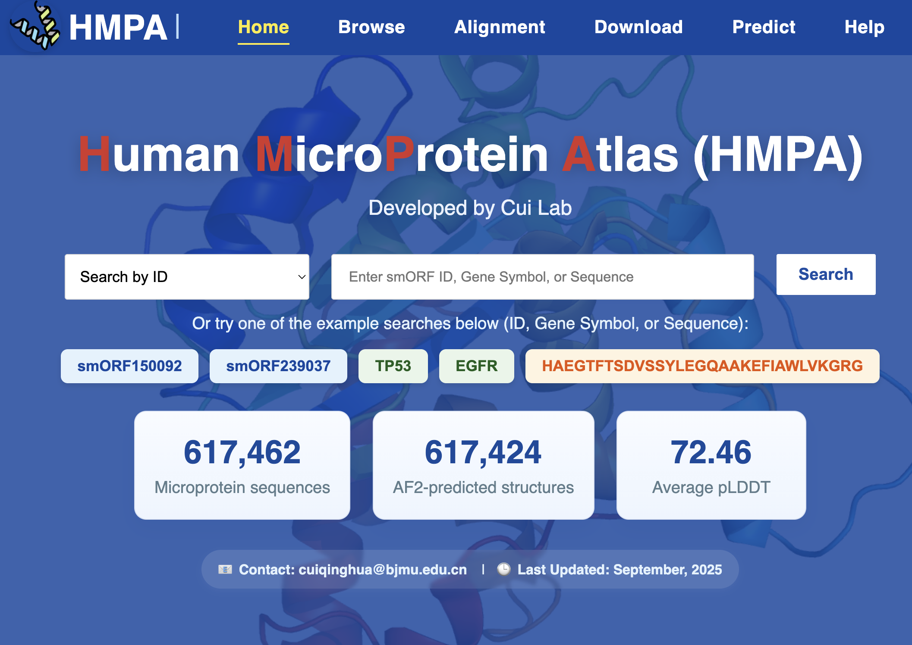

# HMPA Bioactivity Prediction

🧬 Bioactivity prediction workflows for the Human Microprotein Atlas (HMPA)

This repository provides the code used for the bioactivity prediction component of the Human Microprotein Atlas (HMPA) study. It includes workflows for ESM-2 feature extraction, peptide bioactivity model training, and downstream bioactivity prediction for candidate microproteins.

## Overview

The repository supports three connected tasks:

1. extracting sequence embeddings from ESM-2 models
2. training task-specific peptide bioactivity classifiers from precomputed embeddings
3. predicting bioactivity scores for candidate microproteins

In the HMPA study, curated peptide bioactivity annotations were combined with protein language model embeddings to train one binary classifier for each bioactivity task. The trained models were then used to prioritize human microproteins with predicted bioactivities.

### Highlights

- 🔬 ESM-2-based sequence representation for peptides and microproteins
- 🤖 Task-specific bioactivity prediction models trained from curated peptide annotations
- 🌐 Integration with the HMPA web platform for interactive exploration and downstream analysis

## 🌐 HMPA Web Server

The Human MicroProtein Atlas (HMPA) web server is available at [https://www.cuilab.cn/microaf](https://www.cuilab.cn/microaf). It was developed as an interactive companion resource for the HMPA study and provides access to large-scale microprotein annotations generated from the integrative analysis described in the manuscript. The platform supports browsing and querying human microproteins together with sequence features, predicted three-dimensional structures, and functional annotations.

In line with the manuscript, the web server is designed to support sequence-, structure-, and function-oriented exploration of candidate microproteins. It includes modules for browsing, alignment, data download, and prediction, enabling users to investigate microprotein candidates and retrieve key results from the HMPA resource. This repository provides the code for the bioactivity prediction component that supports the broader HMPA platform.



## 📁 Repository Structure

```text
microprotein-bioactivity-prediction/
├── data/
│   ├── peptide_multilabel_dataset.csv
│   └── peptide_task_metadata.csv
├── scripts/
│   ├── extract_esm2_features.py
│   ├── predict_microprotein_bioactivity.py
│   └── train_bioactivity_models.py
├── src/
│   └── hmpa_bioactivity/
│       ├── __init__.py
│       ├── embeddings.py
│       ├── inference.py
│       ├── io_utils.py
│       ├── models.py
│       └── training.py
├── tests/
│   └── test_smoke.py
├── .gitignore
├── pyproject.toml
├── requirements.txt
└── README.md
```

## 📊 Data Files

- `data/peptide_multilabel_dataset.csv`: peptide-level multi-label table used to define the supervised bioactivity tasks. The first column contains peptide sequences, and the remaining columns contain binary labels.
- `data/peptide_task_metadata.csv`: metadata describing bioactivity task names and categories.

These files are included because they are required to reproduce the task definitions and the model-training setup. Large intermediate tensors, trained model weights, and bulk prediction outputs are not tracked in this repository.

## 🧾 Input Requirements

Training and inference require precomputed sequence embeddings stored as PyTorch `.pt` files.

- Training input should be a tensor of shape `(num_sequences, embedding_dim)` aligned row-wise with `data/peptide_multilabel_dataset.csv`.
- Inference input may be either a dense tensor aligned to an input sequence list or an ID-keyed embedding dictionary saved with `torch.save`.

## ⚙️ Installation

We recommend using conda to create an isolated environment for this project.

```bash
conda create -n hmpa_bioactivity python=3.10 -y
conda activate hmpa_bioactivity
pip install -r requirements.txt
pip install -e .
```

If you plan to run ESM-2 feature extraction on GPU, please ensure that your PyTorch installation matches your local CUDA environment.

## 🚀 Usage

### Step 1. Extract ESM-2 embeddings

Use the following script to generate embeddings from peptide or microprotein FASTA files:

```bash
python scripts/extract_esm2_features.py \
  --fasta /path/to/sequences.fa \
  --model-name facebook/esm2_t33_650M_UR50D \
  --output-pt outputs/embeddings.pt \
  --output-ids outputs/sequence_ids.txt \
  --device cuda:0 \
  --batch-size 8 \
  --pooling mean \
  --save-format tensor
```

Notes:

- `mean` pooling averages residue-level embeddings after removing special tokens.
- `cls` pooling uses the first token embedding returned by the model.
- `--local-files-only` is useful on systems where the ESM-2 model has already been downloaded locally.

### Step 2. Train peptide bioactivity models

```bash
python scripts/train_bioactivity_models.py \
  --label-csv data/peptide_multilabel_dataset.csv \
  --feature-pt /path/to/peptide_embeddings.pt \
  --output-dir outputs/train_run \
  --device cuda:0
```

This script performs task-wise cross-validation, selects the best checkpoint for each task using AUPRC, writes a `performance.csv` summary, and stores the trained models under `outputs/train_run/models/`.

### Step 3. Predict microprotein bioactivity

```bash
python scripts/predict_microprotein_bioactivity.py \
  --embedding-pt /path/to/microprotein_embeddings.pt \
  --performance-csv outputs/train_run/performance.csv \
  --models-root outputs/train_run/models \
  --output-path outputs/microprotein_predictions.csv \
  --fasta /path/to/microproteins.fa \
  --device cuda:0
```

This script loads the selected model for each task and generates a prediction matrix with input IDs as rows and bioactivity tasks as columns.

## 📚 Citation

Comprehensive annotation and analysis of human microproteins by human microprotein atlas platform

## 📬 Contact

For questions regarding this repository or the associated study, please contact:

- Boming Kang: kangbm@bjmu.edu.cn
- Chunmei Cui: ccm328@bjmu.edu.cn
